### Koa2学习

### 1、环境搭建

准备环境：node(8.6版本以上)

- 初始化package.json文件

```
npm init
```

- 安装koa生产依赖

```
yarn add koa
```

- 新建index.js文件，编写以下代码

```
const Koa = require("koa");
const app = new Koa();

app.use(async (ctx) => {
  ctx.body = "hello world";
});

app.listen(3000);
console.log("app is running at port 3000");
```

- 运行index.js


 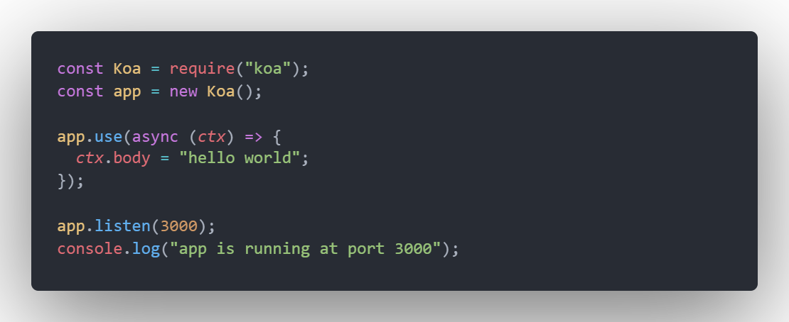


### 2、async/await的使用方法

async是异步的意思，await=async+wait

async 用于声明一个方法是异步的，await是等待异步方法执行完成，需要注意的是await必须在async方法中才可以使用，因为await访问本身就会造成程序停止堵塞，所以必须在异步方法中才可以使用。

- async的返回值是什么，

代码截图：

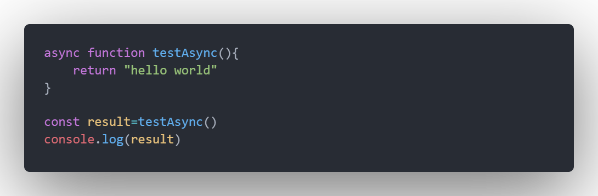

返回的是Promise对象

运行结果：

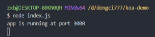

- await在等待什么

等待async方法执行完毕,即可以接收Promise对象（比如async定义的方法），也可以接收普通函数方法（没有使用async定义的方法）

代码截图：


运行结果：

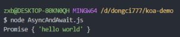

- 模拟异步执行，async和await同时使用

代码截图：

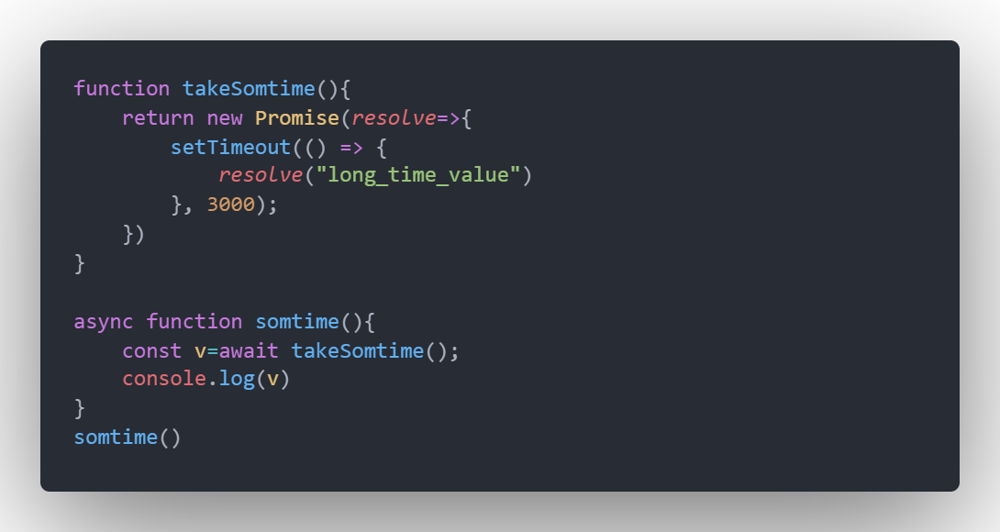

以下程序将会四秒之后打印		

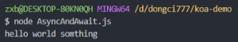


### 3、GET请求接收

通过ctx的request获取和使用ctx本身获取

代码截图：

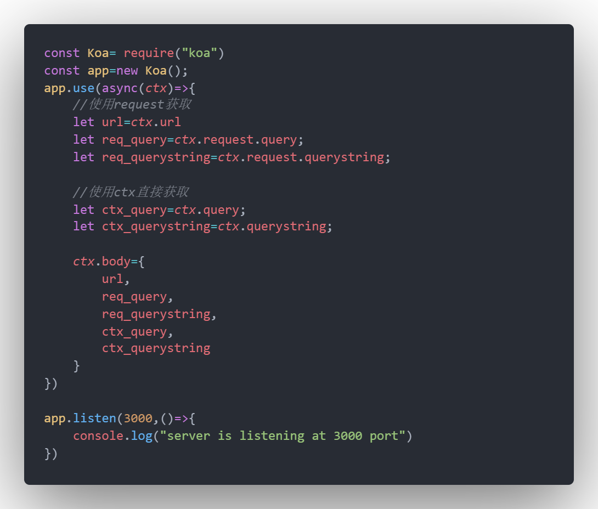

运行结果：

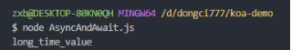

说明：

request.query 返回的是一个对象

request.querystring 返回的是字符串


### 4、POST请求接收

通过method属性对请求方式进行判断

代码截图：

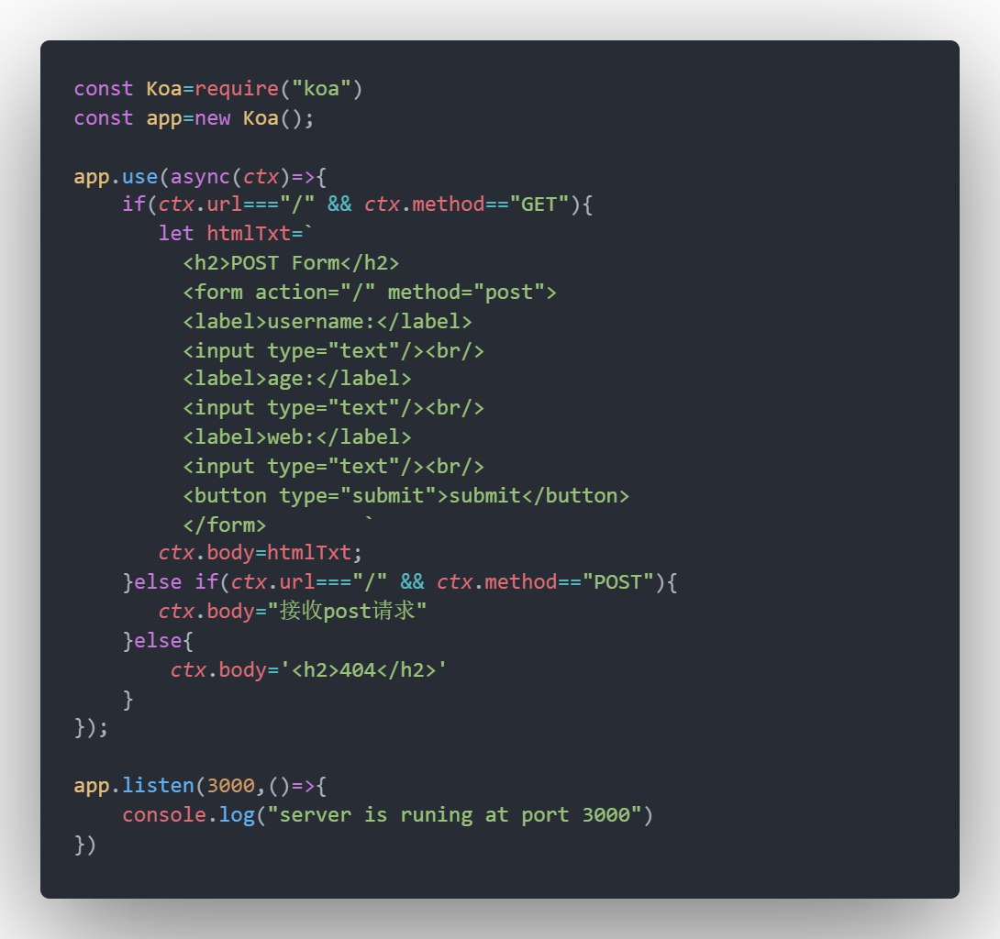

运行GIF结果：

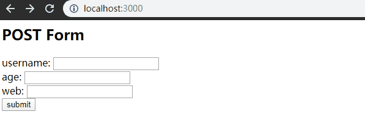

实战：

- 获取POST请求的三个步骤：

1. 解析上下文ctx中的原生nodex.js对象req。
2. 将POST表单数据解析成query string-字符串.(例如:user=jspang&age=18)
3. 将字符串转换成JSON格式

ctx.request 和ctx.req的区别：

- ctx.request:是Koa2中context经过封装的请求对象，它用起来更直观和简单。
- ctx.req:是context提供的node.js原生HTTP请求对象。可以得到更多的内容，适合我们深度编程。


代码截图：

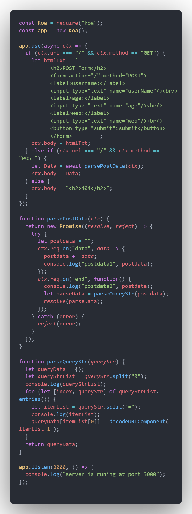

运行结果：

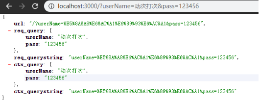

注意点

- 第二个on监听其实可以换成addListener
- 必须写成两个监听处理，也就是说先要接受这个post数据完 了之后才能end监听
- 字符串的split方法使用和数组的entries方法使用
- decodeURIComponent() 函数可对 encodeURIComponent() 函数编码的 URI 进行解码。

```
<script type="text/javascript">
var test1="http://www.w3school.com.cn/My first/"
document.write(encodeURIComponent(test1)+ "<br />")
document.write(decodeURIComponent(test1))
</script>

输出：
http%3A%2F%2Fwww.w3school.com.cn%2FMy%20first%2F
http://www.w3school.com.cn/My first/
```

### 5、Koa-bodyparser中间件使用

作用：koa-bodyparser就是一个造好的轮子。也叫做中间件。对于POST请求的处理，koa-bodyparser中间件可以把koa2上下文的formData数据解析到ctx.request.body中。

代码截图：

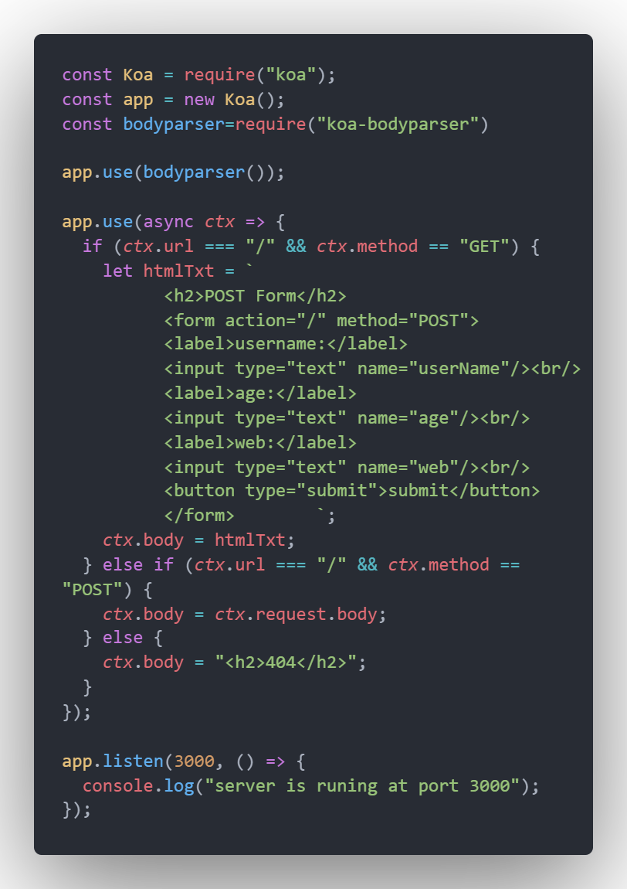

运行结果：

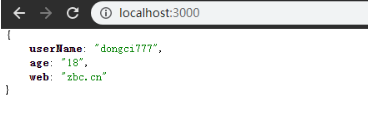

跟4中的接收post请求结果是一样的

### 6、koa原生路由实现

- 获取页面url

  ```
  let url=ctx.ruquest.utl
  ```

- 对url进行判断

- 解析url成html内容

代码截图：

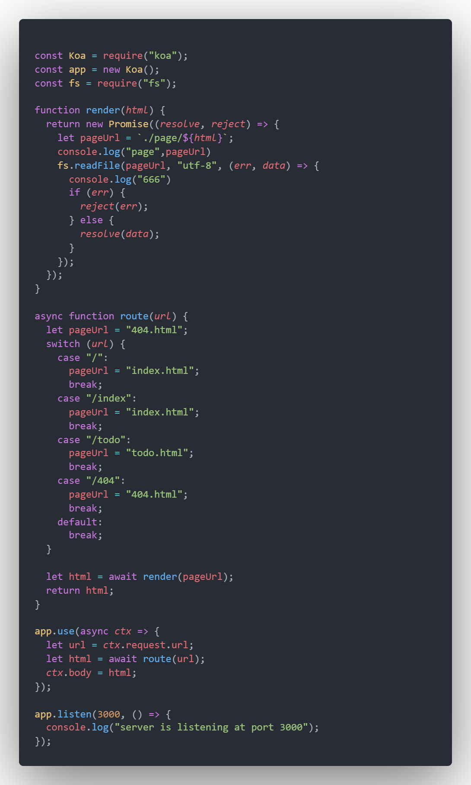

注意：

- 对url进行操作的函数前面需要加上await
- fs的引入使用，如果html页面内容中国含有中文，（只需要把binary换成utf-8即可）

### 7、Koa-router中间件1（koa-router)

步骤：

- 安装koa-router生产依赖

```
yarn add koa-router
```

- 引入

```
const Router=require("koa-router")
```

- 创建对象

```
const router=new Router()
```

- 使用app.user加载

```
app.use(router.routes()).use(router.allowedMethods())
```

代码截图：

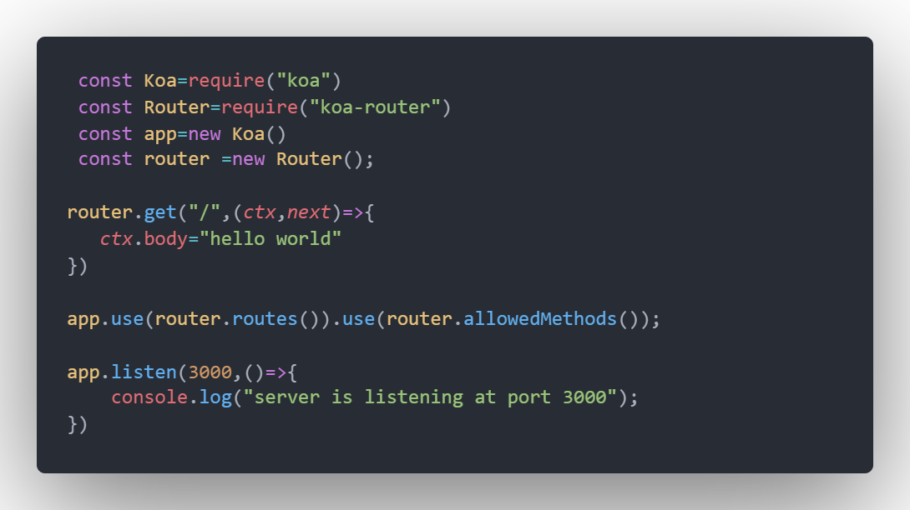


多页面配置

- 只需要在get后面继续添加对应的页面即可

代码截图：

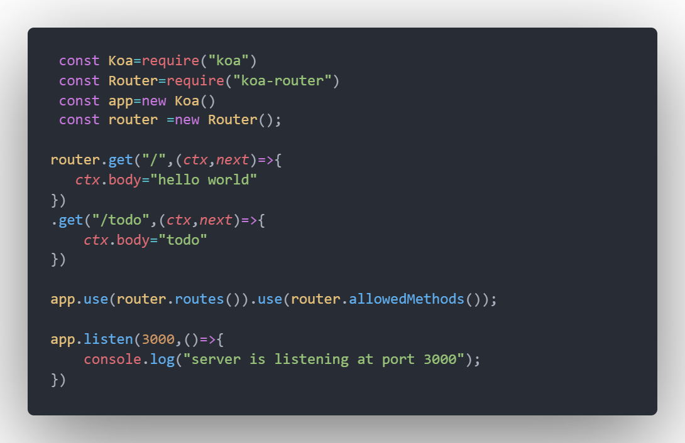

运行结果：

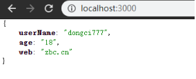

路由加前缀：

```
const router=new Router({
   preffix="/dongci777"
})
```

代码截图：

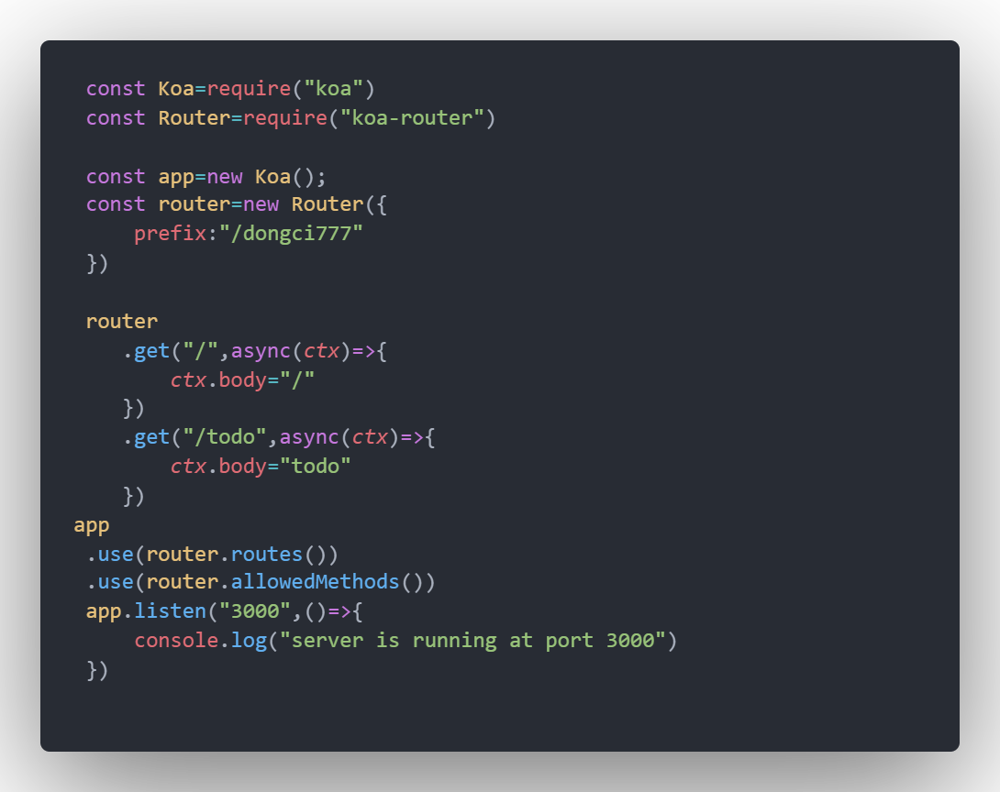

运行结果：

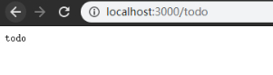

### 8、父子级路由

代码截图：

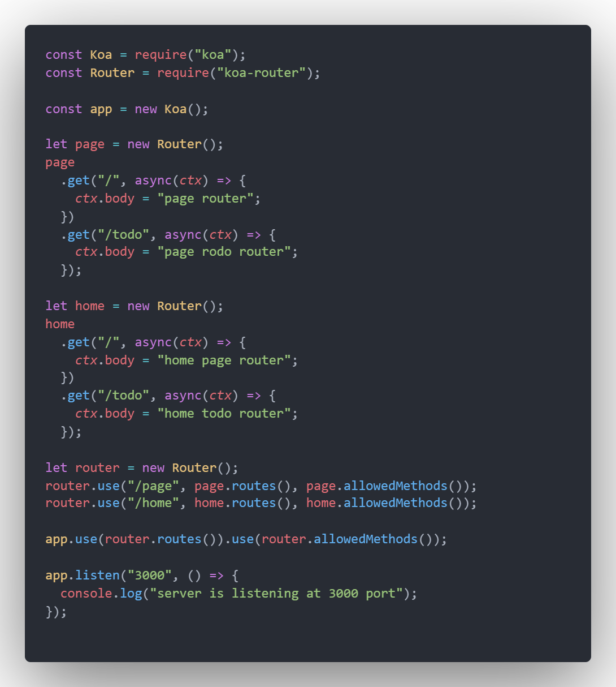

分析：

- 输入http://localhost:3000/home/todo 页面显示：home todo router
- 输入http://localhost:3000/home            页面显示： home page router

另外两个路由同上


### 9、koa2中的cookie的使用

代码截图：

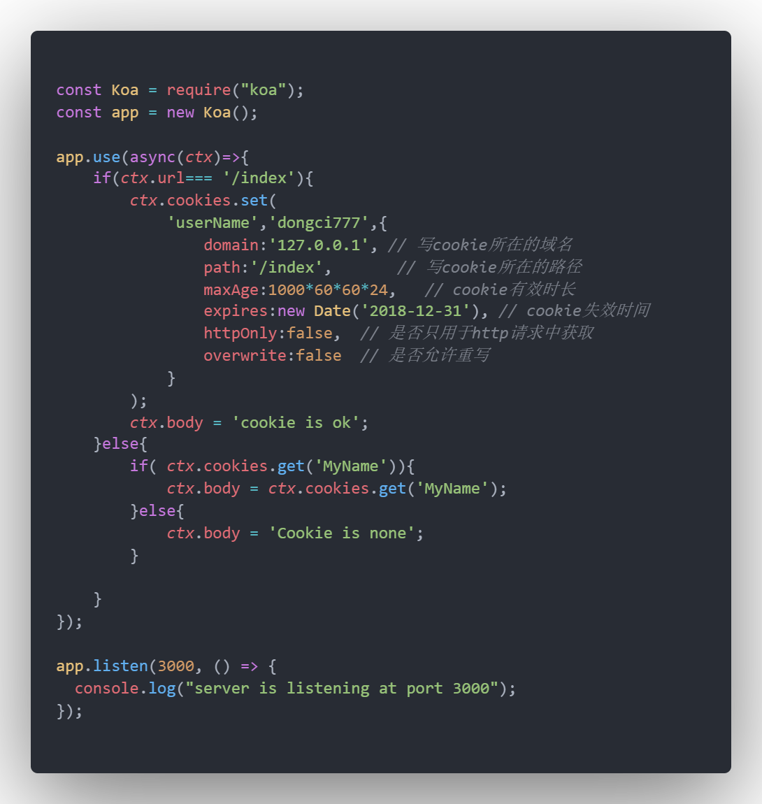

cookie设置参数说明：

- domain：写入cookie所在的域名
- path：写入cookie所在的路径
- maxAge：Cookie最大有效时长
- expires：cookie失效时间
- httpOnly:是否只用http请求中获得
- overwirte：是否允许重写

### 10、模板ejs

- 安装koa-views生产依赖

```
yarn add koa-views
```

- 安装ejs

```
yarn add ejs
```

代码截图：

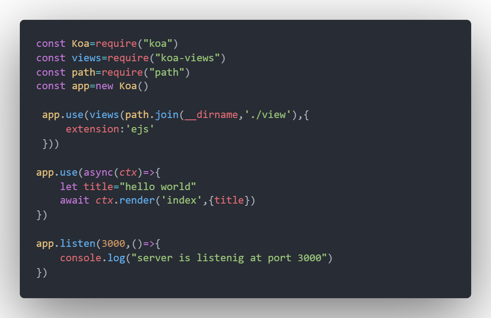

index.ejs文件：

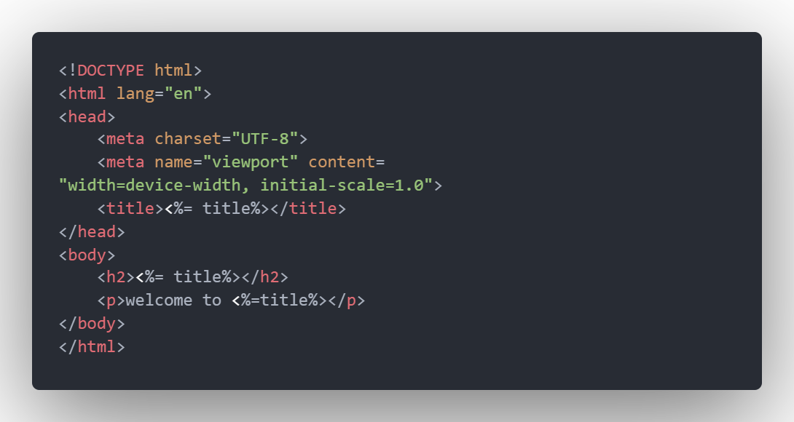

运行结果：

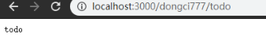

### 11、koa静态资源使用

- 安装koa-static中间件生产依赖

```
yarn add koa-static
```

代码截图：

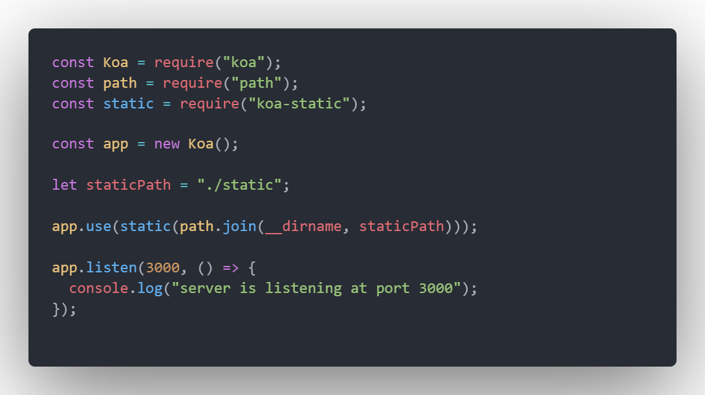

静态资源文件结构：


访问结果：

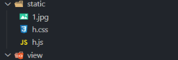


结束了！
